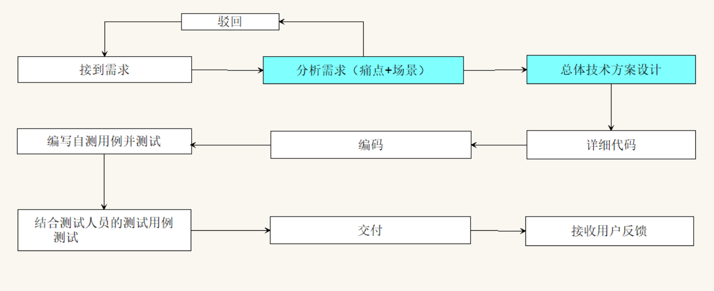
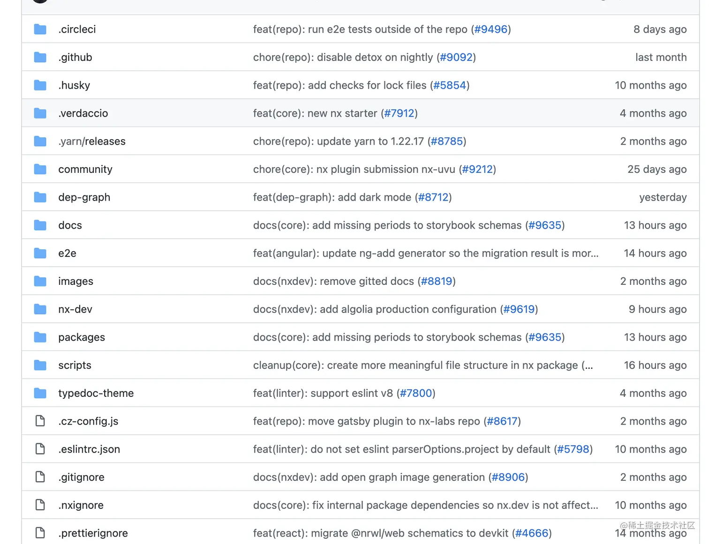
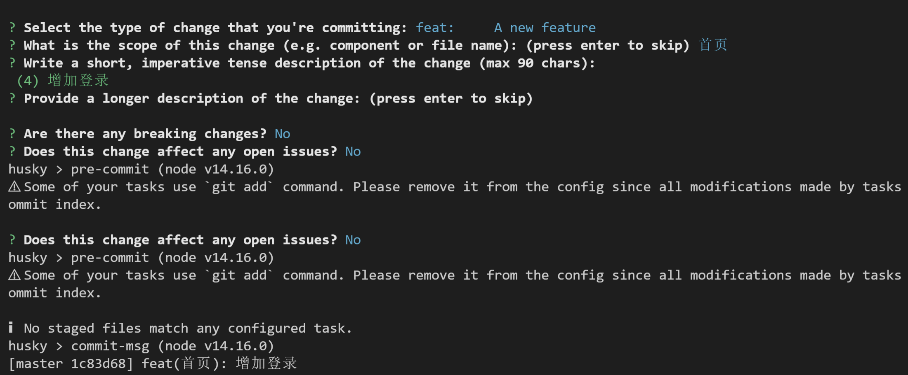

# 前端规范相关

## 开发流程规范

## 格式化规范

`npm install prettier --save-dev`

## JS/TS规范

`"lint-staged": {
    "**/*": "prettier --write --ignore-unknown", //格式化
    "src/*": "eslint --ext .js,.ts,.tsx"  //进行eslint校验
  }`

## css规范

`npm install --save-dev stylelint stylelint-config-standard`
`"lint-staged": {
    "**/*": "prettier --write --ignore-unknown",
    "src/*": "eslint --ext .js,.ts,.tsx",
    "**/*.{less,css}": "stylelint --fix"
  }`

### 解决css与prettier冲突

`npm install --save-dev stylelint-config-prettier`

## 其他的规范

### （1）命名规范

变量的命名中应尽量减少缩写的情况发生，做到见名知意。
`
// 👎 自我感觉良好的缩写:
let rContent = 'willen';

// 👍 无需对每个变量都写注释，从名字上就看懂
let firstName = 'jackie';

// 👎 从命名无法知道返回值类型
function showFriendsList() {....} // // 无法辨别函数意图,返回的是一个数组，还是一个对象，还是true or false?

// 👍 明确函数意图，对于返回true or false的函数，最好以should/is/can/has开头
function shouldShowFriendsList() {...}
function isEmpty() {...}
function canCreateDocuments() {...}
function hasLicense() {...}
function sendEmailToUser(user) {.... } //动词开头，函数意图就很明显
`

### （2）写注释

`/\*\*

- 导航页面-右边区域
  \*/

const Content=>()=>xxx

const MAX_INPUT_LENGTH = 8; //用于限制密码输入框

function Component(props) {
return (
<>
{/_ 如果用户没有订阅则不展示广告 _/}
{user.subscribed ? null : <SubscriptionPlans />}
</>
)
}`

### （3）变量兜底

`// 👎 对于求值获取的变量，没有兜底
const { data } = getApiRequest();
data.map((s) => s.id); //没有考虑data异常的情况，代码一跑就爆炸

// 👍 对于求值变量，做好兜底
const { data = [] } = getApiRequest();
data.map((s) => s?.id); //没有考虑data异常的情况，代码一跑就爆炸`

### （4）辅助函数必须是纯函数

`// 👎 不要让功能函数的输出变化无常
function plusAbc(a, b, c) {  // 这个函数的输出将变化无常，因为api返回的值一旦改变，同样输入函数的a，b,c的值，但函数返回的结果却不一定相同。
  var c = fetch('../api');
  return a+b+c;
}

// 👍 功能函数使用纯函数，输入一致，输出结果永远唯一
function plusAbc(a, b, c) {  // 同样输入函数的a，b,c的值，但函数返回的结果永远相同。
  return a+b+c;
}
`

### （5）优先使用函数式编程

`// 👎 使用for循环编程
for(i = 1; i <= 10; i++) {
a[i] = a[i] +1;
}

// 👍 使用函数式编程
let b = a.map(item => ++item)
`

### （6）优先使用函数式组件

除非需要用到错误边界，否则函数式组件应该是首选方法。

### （7）组件复杂度

如果一个组件做的事情太多，应适当提取一些逻辑，将其拆分为更小的组件。

如果提取的组件很复杂，则需要依照一定的规则和条件一一提取它。

代码行数并不是一个客观的衡量标准，更多是需要考虑责任划分和抽象。

### （8）用错误边界

当需要对大量数据进行渲染处理时，需要通过错误边界组件对其进行降级处理。

`function Component() {
return (
<Layout>
<ErrorBoundary>
<CardWidget />
</ErrorBoundary>

      <ErrorBoundary>
        <FiltersWidget />
      </ErrorBoundary>

      

        <ErrorBoundary>
          <ProductList />
        </ErrorBoundary>
      

    </Layout>

)
}`

### （9）props参数传递

props一层层传递一直是我们很头疼的一个问题，最核心的问题是不清楚props是从哪个初始组件传来的，以及props中到底有哪些东西，上下文是什么？
因此对于传递较深的场景我推荐直接使用 context，对于 props 中的内容和上下文通过 TS 来解决。

`// A.tsx
interface AProps {
param: string;
}
const A = ({ param }: AProps) => {
return <B param = {param} />;
};

// 👍 上下文清晰
// B.tsx
const B = ({ param }: { param: AProps['param'] }) => {
return 
hello world
;
};`

### （10）props传参数量

如果超过 5 个props，就该考虑是否拆分该组件。在某些情况下，这是需要对组件进行重构的标志。

### （11）避免嵌套三元运算符

三元运算符在第一级之后变得难以阅读，虽然看起来节省了代码空间，但最好在代码中明确意图，保持良好的阅读性。

`// 👎 不够清晰，要是再嵌套一层两层呢
isSubscribed ? (
<ArticleRecommendations />
) : isRegistered ? (
<SubscribeCallToAction />
) : (
<RegisterCallToAction />
)

// 👍 将判断逻辑进行拆分
function CallToActionWidget({ subscribed, registered }) {
if (subscribed) {
return <ArticleRecommendations />
}

if (registered) {
return <SubscribeCallToAction />
}

return <RegisterCallToAction />
}

function Component() {
return (
<CallToActionWidget
      subscribed={subscribed}
      registered={registered}
    />
)
}`

### （12）将列表组件封装成独立组件

`// 👎 列表渲染和其他逻辑杂糅在一起
function Component({ topic, page, articles, onNextPage }) {
return (

<h1>{topic}</h1>
{articles.map(article => (

<h3>{article.title}</h3>

{article.teaser}

))}

You are on page {page}

<button onClick={onNextPage}>Next</button>

)
}

// 👍 将列表组件提取出来，一目了然
function Component({ topic, page, articles, onNextPage }) {
return (

<h1>{topic}</h1>
<ArticlesList articles={articles} />

You are on page {page}

<button onClick={onNextPage}>Next</button>

)
}`

### （13）避免嵌套渲染函数

`// 👎 不要将其定义在渲染函数组件中
function Component() {
function renderHeader() {
return <header>...</header>
}
return 
{renderHeader()}

}

// 👍 将其抽离到独立的组件中去
import Header from '@modules/common/components/Header'

function Component() {
return (

<Header />

)
}`

### （14）组件/函数导入导出

`// 👍 在文件头部导入，顺序依次为: 第三方库 > 公共组件/方法 > 非公共部分组件/方法
import React from 'react'
import \_ from 'loadsh'
import Header from '@components/header'
import Content from './Content'

// 👍 在底部导出
export { Content, Header }
export default Component
`

## 文件结构规范

文件夹名称全部采用小写加 "-" 来隔开，index.ts更多是用来做导出作用，要不然最后编辑器中满屏的index.tsx，很难区分
`- src 开发目录
      - pages 视图
          - module-a 模块A
            - components 私有组件
              - ComA.tsx
              - ComB.tsx
            - index.module.less
            - index.tsx
            - Content.tsx
          - module-b 模块B
      - components 公共组件
        - index.ts 导出所有组件
        - header
          - index.tsx
          - index.module.less
          - User.tsx
          - useGetBaseInfo.hooks.ts
      - routers 路由文件
      - store redux中的数据
      - utils 这里是以utils为后缀
        - index.ts
        - a.utils.ts
        - b.utils.ts
      - hooks 这里是以hooks为后缀
        - index.ts
        - a.hooks.ts
        - b.hooks.ts
      - styles 静态资源文件
      - service api请求,这里是以api为后缀
        - a.api.ts 按照后端微服务进行划分
        - b.api.ts
      - constans 常量
`

## Git commit规范

git commit 规范主要可以帮助开发人员在 code review 期间更容易理解提交的内容，现在大部分主流 commit 规范都是基于Angular 团队的规范而衍生出来的
`<type>(<scope>): <subject>
<BLANK LINE>

<body>
<BLANK LINE>
<footer>
`
每个提交消息都包含一个subject、一个body和一个footer (中间使用空行分割)，提交信息的任何一行不能超过 100 个字符。

`
👉 type主要有以下几种类型：

feat: 一个新特性
fix: 修复bug
docs: 文档修改
style: 不影响代码含义的更改（空格、格式、缺少分号等）
refactor: 代码重构
perf: 优化性能
test: 测试用例修改
chore: 对构建过程或辅助工具和库的更改，例如文档生成

👉 scope：可以是影响范围的任何内容。
👉 subject：包含对更改的简洁描述，规则：

使用陈述语句
第一个字母不要大写
末尾没有点 (.)

👉 body：commit 具体修改内容, 可以分为多行，应该包括改变的动机，并与以前的行为进行对比。
👉 footer: 一些备注, 通常是修复的 bug 的链接。
`

eg:
`git commit -m "提交测试6"
`
`D:\HZQ\myhuskypro\my-husky-project\node_modules\.bin\commitlint --edit .git/COMMIT_EDITMSG
⧗   input: 提交测试6
✖   subject may not be empty [subject-empty]
✖   type may not be empty [type-empty]`

`$ git commit -m "feat: 提交测试6"
[STARTED] Preparing lint-staged...
[COMPLETED] Preparing lint-staged...
[STARTED] Hiding unstaged changes to partially staged files...
[COMPLETED] Hiding unstaged changes to partially staged files...
[STARTED] Running tasks for staged files...
[STARTED] package.json — 10 files
[STARTED] **/* — 10 files
[STARTED] src/* — 0 files
[STARTED] **/*.{less,css} — 1 file
[SKIPPED] src/* — no files
[STARTED] prettier --write --ignore-unknown
[STARTED] stylelint --fix
[COMPLETED] prettier --write --ignore-unknown
[COMPLETED] **/* — 10 files
[COMPLETED] stylelint --fix
[COMPLETED] **/*.{less,css} — 1 file
[COMPLETED] package.json — 10 files
[COMPLETED] Running tasks for staged files...
[STARTED] Applying modifications from tasks...
[COMPLETED] Applying modifications from tasks...
[STARTED] Restoring unstaged changes to partially staged files...
[COMPLETED] Restoring unstaged changes to partially staged files...
[STARTED] Cleaning up temporary files...
[COMPLETED] Cleaning up temporary files...
`

有了规范后，我们需要通过工具去约束：commitlint。它要做的就是在我们每次提交 git commit 的时候，都会帮我们检查 commit message 是否符合一定的规范，如果不符合，就让这次提交失败。
具体配置：
`

### 1、安装 commitlint cli 和 conventional config

npm install --save-dev @commitlint/{config-conventional,cli}

### Windows:

npm install --save-dev @commitlint/config-conventional @commitlint/cli

配置要使用的 commitlint 规则
echo "module.exports = {extends: ['@commitlint/config-conventional']}" > commitlint.config.js

加入到husky中：
npx husky add .husky/commit-msg 'npx --no -- commitlint --edit "$1"'
or
yarn husky add .husky/commit-msg 'yarn commitlint --edit $1'
`

### 2、交互式强制提交message按照规范来
#### 1、安装Commitizen

可以使用npm安装Commitizen。其中，cz-conventional-changelog是本地适配器。
`npm install commitizen cz-conventional-changelog --save-dev
`

#### 2、配置Commitizen

安装好Commitizen之后，就需要配置Commitizen，我们需要在package.json中加入以下代码。其中，需要增加一个script，使得我们可以通过执行npm run cm

来代替git commit，而path为cz-conventional-changelog包相对于项目根目录的路径。
`"script": {  "cm: "git-cz" },"config": {
  "commitizen": {
    "path": "./node_modules/cz-conventional-changelog"
  }
}
`
配置完成之后，我们就可以通过执行npm run cm来代替git commit，接着只需要安装提示，完成header、body和footer的编写，就能够编写出符合规范的

`
<!-- PS D:\HZQ\myhuskypro\my-husky-project> yarn commit
yarn run v1.22.19
$ git-cz
cz-cli@4.3.0, cz-conventional-changelog@3.3.0

? Select the type of change that you're committing: feat:     A new feature
? What is the scope of this change (e.g. component or file name): (press enter to skip) commit 模板
? Write a short, imperative tense description of the change (max 83 chars):
error Command failed with exit code 1.
info Visit https://yarnpkg.com/en/docs/cli/run for documentation about this command.
PS D:\HZQ\mine\myhuskypro\my-husky-project> yarn commit
yarn run v1.22.19
$ git-cz
cz-cli@4.3.0, cz-conventional-changelog@3.3.0

? Select the type of change that you're committing: feat:     A new feature
? What is the scope of this change (e.g. component or file name): (press enter to skip) 全局
? Write a short, imperative tense description of the change (max 90 chars):
 (10) 添加commit模板
? Provide a longer description of the change: (press enter to skip)

? Are there any breaking changes? No
? Does this change affect any open issues? No
[STARTED] Preparing lint-staged...
[COMPLETED] Preparing lint-staged...
[STARTED] Running tasks for staged files...
[STARTED] package.json — 6 files
[STARTED] **/* — 6 files
[STARTED] src/* — 0 files
[STARTED] **/*.{less,css} — 0 files
[SKIPPED] src/* — no files
[SKIPPED] **/*.{less,css} — no files
[STARTED] prettier --write --ignore-unknown
[COMPLETED] prettier --write --ignore-unknown
[COMPLETED] **/* — 6 files
[COMPLETED] package.json — 6 files
[COMPLETED] Running tasks for staged files...
[STARTED] Applying modifications from tasks...
[COMPLETED] Applying modifications from tasks...
[STARTED] Cleaning up temporary files...
[COMPLETED] Cleaning up temporary files...
$ D:\HZQ\mine\myhuskypro\my-husky-project\node_modules\.bin\commitlint --edit .git/COMMIT_EDITMSG
[test 088951f] feat(全局): 添加commit模板
 6 files changed, 2057 insertions(+), 13 deletions(-)
 create mode 100644 .getmessage.txt
 create mode 100644 image.png
Done in 37.73s. -->
`

`PS D:\HZQ\myhuskypro\my-husky-project> git log
commit 088951fb418f599399751a655892c21cad21848e (HEAD -> test)
Author: hezhegnquan <hhq87776153@hotmail.com>
Date:   Mon Nov 6 14:24:13 2023 +0800
feat(全局): 添加commit模板`

## ui设计规范

优秀的开发者应该反向推动UI的规范，并且能够支撑UI规范的落地。
UI 规范的最大好处就是能够提质提效：

在开发者的角度，与设计规范同步形成研发资产，避免重复造轮子；
在测试的角度，能够避免重复的无意义走查；
在UI设计师的角度，减少设计成本，提高设计效率，可以快速承接新需求；
站在产品角度，提高产品迭代与优化效率，降低试错成本；
站在用户角度，解决用户体验一致性。

那到底应该怎么去推动UI规范？我的做法是先让设计师去给出一系列的规范，没有相关规范就拉上产品经理一起制定规范。然后前端建立一套自己的组件库，再将组件库提供给UI设计师，以此来相互监督是否达成了规范协议。
具体参考 Antd设计规范。

# 综上

统一规范的最根本目的是为了保证团队成员的一致性，从而减少沟通成本，提高开发效率。
学会热爱标准，但要确保它们不是一成不变的。如果制定的规范不适合您的团队，请确保可以适应和重写所需要的任何规则。它并不是要强制执行一种工作方式，而是为了帮助促进团队之间的互动。
